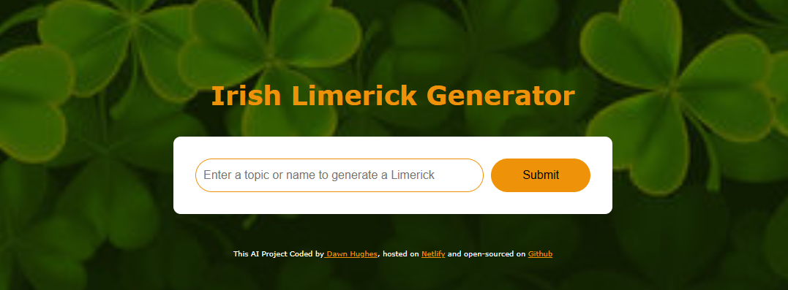

## AI Irish Limerick Generator

# Overview

This project is a fun and interactive AI-powered Irish Limerick Generator that creates humorous and cheeky Irish limericks based on user input. Inspired by my Irish family humor, this app is designed to bring joy through AI-generated poetry while also improving my skills as a developer working with AI APIs, frontend development, and API integration.

## Technologies Used

- HTML, CSS, and JavaScript for the front-end structure, styling, and interactivity

- Axios for making API requests

- SheCodes AI API for generating limericks

- Typewriter Effect for animated text display

- Netlify for hosting the project

- GitHub for version control and open-source collaboration

## Improvements and Features

1. Enhanced User Experience

- Interactive UI: A clean and simple design with an input field for users to specify a topic for the limerick.

- Real-time Feedback: Displays a fun loading message with a blinking animation while generating a limerick.

- Typewriter Effect: Smoothly animates the generated limerick for an engaging experience.

2. Improved API Handling

- Uses Axios to fetch AI-generated limericks dynamically.

- Provides detailed console logs for debugging and transparency.

- Ensures random and unique limericks each time by specifying creative prompts.

3. Thematic and Fun AI Prompting

- The AI is guided with a custom personality as an “Irish traditions expert” to generate authentic and humorous limericks.

- Automatically formats the output with spacing and a personalized signature message.

4. Stylish and Responsive Design

- Irish-themed aesthetics with a warm orange and white color scheme.

- Background Image of an Irish countryside for added immersion.

- Responsive layout that adapts well on desktop and mobile screens.

5. Deployment & Open Source

- Hosted on Netlify, making it accessible from anywhere.

- Open-sourced on GitHub, allowing collaboration and improvements.

## How It Works

- Enter a topic (e.g., "A leprechaun in Dublin").

- Click the Submit button.

- The AI generates and displays a unique limerick in a typewriter-style effect.

The limerick is signed off with a personal touch: "The gift of a smile from Dawn with the help of SheCodes AI."

## 📷 Preview
Here’s what my weather app looks like:  

## Live Demo 

Live Demo: https://3potsofgold.netlify.app/

## Future Enhancements

-🔹 Customizable Themes – Allow users to switch between different Irish-themed styles.
-🔹 Voice Input Support – Enable users to speak their topic instead of typing.
-🔹 User Rating System – Let users rate the generated limericks for AI improvement.
-🔹 More Irish Sayings – Expand AI prompts to include Irish proverbs and jokes.

## My Growth as a Developer 🚀

This project marks a significant milestone in my development journey:
- ✅ Deeper API understanding – Integrated an external AI API with structured API calls.
- ✅ Better UI/UX skills – Improved styling, animations, and responsiveness.
- ✅ Frontend and AI synergy – Learned to combine frontend design with AI-generated content.
- ✅ Hosting & Deployment experience – Gained hands-on experience with Netlify and GitHub.

## ☘️Contributions & Feedback☘️

Feel free to contribute or suggest improvements via GitHub issues or pull requests. 
This project combines tech, humor, and Irish culture to create something entertaining while showcasing skills in JavaScript, API integration, and UI design. Enjoy generating your own Irish limericks! 🎭🍀

